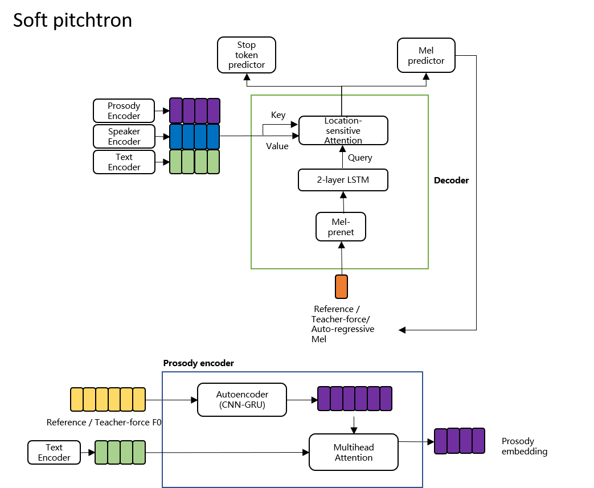
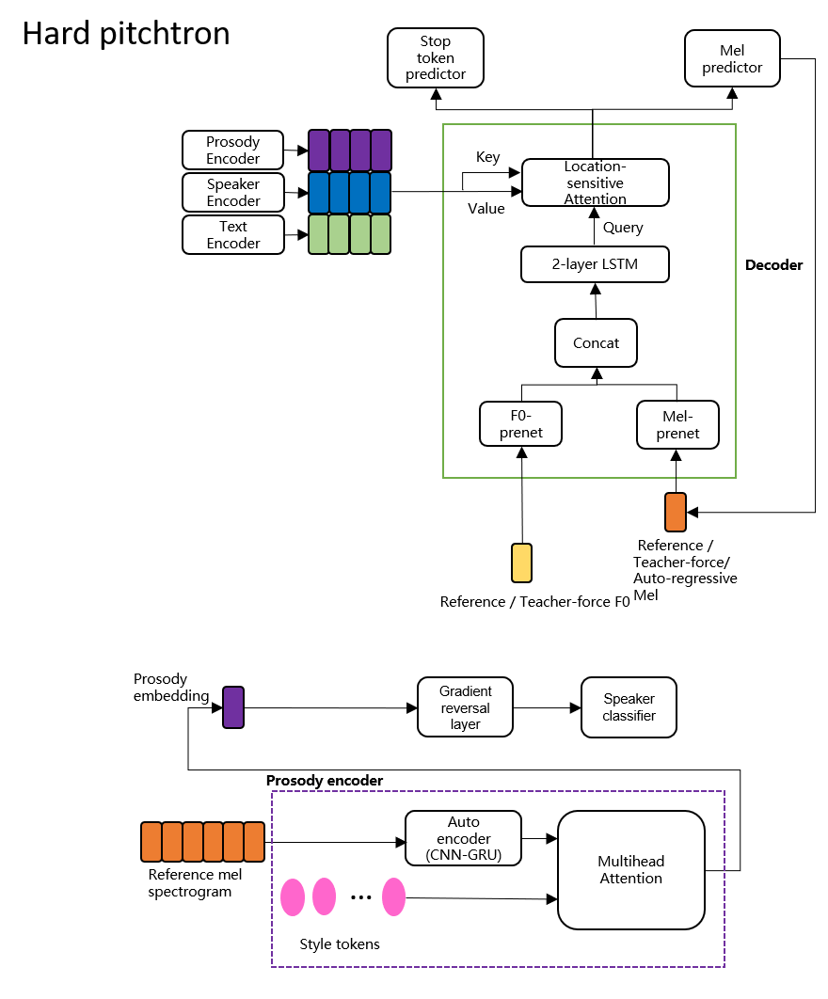
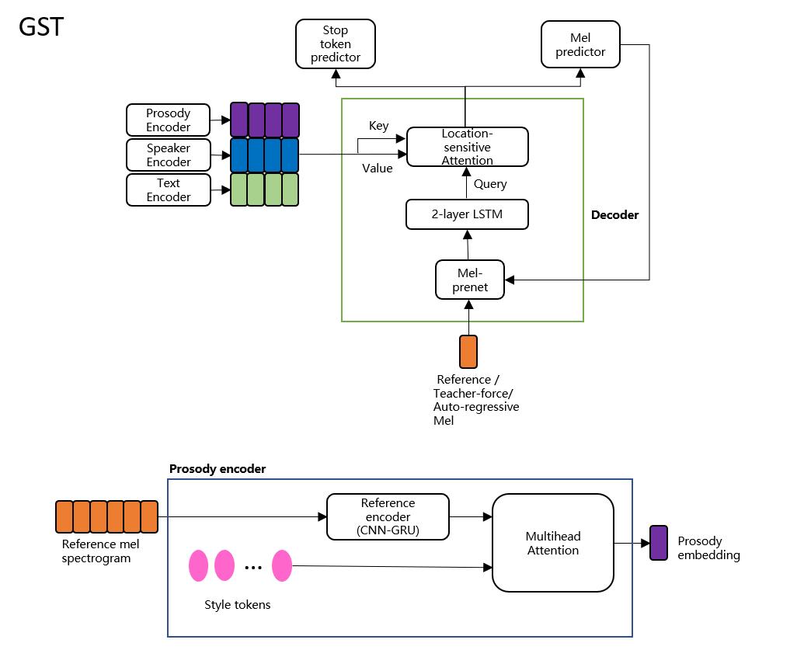

Pitchtron
============


* Prosody transfer toolkit with which you can generate stylish speeches even though your training DB is neutral voices from ordinary people.
* We can transfer Korean dialects(Kyongsang, Cheolla) and emotive prosodies as well as neutral dialogues.
* Hard pitchtron is for strictly transferring the prosody thus, the sentence structure of reference audio and target sentence better match.
* Soft pitchtron pursues natural sounding prosody transfer even the reference audio and target sentence are totally different in content.
* The DB we are releasing with this project is available at [emotion_tts](https://github.com/emotiontts/emotiontts_open_db)  
* Audio samples are available at http://sunghee.kaist.ac.kr/entry/pitchtron

Differences of three branches
====================
* All three branches provided here are for **prosody transfer.**
* You can generate speech of desired style,sentence and voice.
    * The speaker of reference audio can be anyone and that person is not necessary to be included in the training data.
    * The target speaker (the voice of synthesized audio) must be included in the training data.
* Using hard and soft pitchtorn, you can synthesize in 'Kyongsang' dialect, 'Cheolla' dialect and emotional style even if the model is only trained with plain, neutral speech.
* On the other hand, for global style token, you need the DB of desired style during training time.
* I proposed this **pitchtron** in order to speak in Korean Kyongsang anc Cheolla dialect.
* The DB of these dialects are very limited and 'pitch contour' is key to referencing them naturally. This is also true of many other pitch-accented language(Japanese), tonal langauge(Chinese) and emotional speaking style.


|                | Temporal resolution | Linear control | Vocal range adjustment | Non-parallel referencing | Unseen style support | Dimension analysis requirement |
|----------------|---------------------|----------------|------------------------|--------------------------|----------------------|--------------------------------|
| GST            | X                   | X              | X                      | O                        | X                    | O                              |
| Soft pitchtron | O                   | *              | O                      | O                        | O                    | X                              |
| Hard pitchtron | O                   | O              | O                      | **                       | O                    | X                              |
* *: Soft pitchtron will let you control the pitch as long as it can sound natural. If it is out of vocal range of target speaker, it will be clipped to make natural sound.
* **: Hard pitchtron allows limited non-parallel referencing.
    * Limited non-parallel: the text can differ, but the structure of the sentence must match.
   
|           | Sentence                                        |
|-----------|-------------------------------------------------|
| Reference | "아니요 지는 그짝허고 이야기허고 싶지 않아요"   |
| Target    | "그래요 갸는 친구허고 나들이가고 싶은것 같아요" |
* Meaning of each column
1. Temporal resolution: Can we control the style differently by timestep?
2. Linear control: Can I control exactly to what amount the pitch(note) is going to be scaled? I don't have to explore on the embedding space to figure out the scale change in embedding dimension as the input changes?
3. Vocal range adjustment: If the vocal range of reference speaker and target speaker are drastically different, can I reference naturally in target speaker's vocal range?
4. Non-parallel referencing: If the reference sentence and target sentence are different, can I synthesize it naturally?
5. Unseen style support: If the desired reference audio is of the style that has never been seen during training, can it be transferred naturally?
6. Dimension analysis requirement: Do I have to analyze which token/dimension controls which attribute to have control over this model?


**1. Soft pitchtron**
---------------------
* This branch provides unsupervised prosody transfer of parallel, limited non-parallel and non-parallel sentences.
* Parallel: Reference audio sentence and target synthesis sentence matches.
* Limited non-parallel: mentioned above.  
* Non-parallel: Reference audio sentence and target synthesis sentence need not match.
* Similar to Global style token, but there are several advantages.
    * It is much more robust to styles that are unseen during training.
    * It is much easier to control.
        * You don't have to analyze tokens or dimensions to see what each token does.
        * You can scale the pitch range of reference audio to fit that of target speaker so that inter-gender transfer is more natural.
        * You can also control pitch for every phoneme input
* Pitch range of reference audio is scaled to fit that of target speaker so that inter-gender transfer is more natural.
* Your control over pitch is not so strict that it will only scale to the amount it sounds natural.



**2. Hard pitchtron**
-------------------------
* This branch provides unsupervised parallel and 'limited non-parallel' unsupervised prosody transfer.
* Instead, the rhythm and pitch are exactly the same as reference audio.
* Pitch range of reference audio is scaled to fit that of target speaker so that inter-gender transfer is more natural.
* You have strict control over pitch range, to the amount where it will scale even if it results in unnatural sound.



**3. Global style token**
---------------------------
* Global style token implementation. 
[Global style token](https://arxiv.org/abs/1803.09017)
* Unlike pitchtron, global style token tend to work well only for the styles that are seen during training phase.
* Pitch range cannot be scaled, resulting noisy sound if reference audio is out of vocal range of target speaker.
* Since it is not robust to new style unseen during training, it sometimes generates speech with too loud energy or too long pause.


# Preprocessing steps to run for multi-speaker Korean TTS
```
python preprocess.py --dataset={following keywords}
```
Run them in following order. You can opt out some parts depending on your needs.

1. selvas_multispeaker_pron
2. public_korean_pron
3. integrate_dataset
4. check_file_integrity
5. generate_mel_f0

## 1. selvas_multispeaker_pron
* raw pcm to wav_22050 under each speaker
    * src:'{data_root}/{speaker}/raw/*.pcm'
    * dst: '{data_root}/{speaker}/wav_22050/*.wav'
* trim with 25 top dB
* data split: for every 400 audio, make it eval & the same for test
    * train: 33194 wavs
    * eval: 83 wavs
    * test: 84 wavs
* generate meta file with script that is in phoneme
    *filelists/single_language_selvas/train_file_list_pron.txt
    
## 2. public_korean_pron
* where to download: [서울말 낭독체 발화 말뭉치](https://ithub.korean.go.kr/user/total/referenceManager.do)
* regularize sampling rate to 22050 Hz (This DB has irregular sr) 
* Trim with top 25 dB
* source: 
    * wav_16000/{speaker}/*.wav
    * pron/{speaker}/t**.txt
    * Excluded from script:
        * the script for unzipping and moving the wavs to wav_16000 is not included. You need to make it in this form yourself
        * Text file for all speakers are equal in this DB, so I divided this shared script by literature manually.(It includes missing newline errors so I had to do it manually)
        * Also, the script for G2P is also not included
        * Additional errors in this DB are
        ```
        1. Missing speaker:  fy15, mw12
        2. Wrong data format: mw13_t01_s11.wav, mw13_t01_s12.wav, mw02_t10_s08.wav
        3. Overlapping files and naming mistakes: mv11_t07_s4' (==mv11_t07_s40), fy17_t15_s18(==fy17_t16_s01), fv18_t07_s63(==fv18_t07_s62) 
        ```
* dst: wav_22050/{speaker}/*.wav

## 3. integrate_dataset
* I integrate above two Korean DBs.
* This can be generalized to multi-lingual TTS where there are multiple DBs of different languages.
* Thus, language code correspoding to each DB is appended to the integrated meta text file created in this step.
* How to

1. Modify source file lists('train_file_lists', 'eval_file_lists', 'test_file_lists') and target file lists(target_train_file_list, target_eval_file_list, target_test_file_list) 
 from preprocess.preprocess.integrate_dataset(args)
2. You might want to modify _integrate() method to designate **language code** for each DB. Sorry it is hard-codded for now.
3. Run preprocess.py
```
python preprocess.py --dataset=integrate_dataset
```

## 4. check_file_integrity
* This step generates meta file with wav paths that has been unable to read.
* You might wanna remove them from your final filelists or go through some investigation. It's on you. This step does not remove these detected files from the filelists.
* out: problematic_merge_korean_pron_{}.txt 

## 5. generate_mel_f0 (optional)
* This step is optional. This step extracts features for training and save as files.
* src: wav_22050/*.wav
* dst: mel/\*.pt and f0/\*.pt

## 6. initialize first few epochs with single speaker DB
* Prepare separate train, valid filelists for single speaker 
* Files for single speaker training and validation are also included in multispeaker filelists.
* I experimented training initial 30 epochs with single speaker DB and it helped learning encoder-decoder alignment a lot.

How to train?
===============

 **1. Commands**
------------ 

```
python train.py {program arguments}
```

**2. Program arguments**
-------------

| Option | Mandatory |                   Purpose                   |
|--------|-----------|:-------------------------------------------:|
|   -o   |     O     | Directory path to save checkpoints.         |
|   -c   |     X     | Path of pretrained checkpoint to load.      |
|   -l   |     O     | Log directory to drop logs for tensorboard. |

**3. Pretrained models**
-----------------------
| Model              | Pretrained checkpoint | Matching hyperparameters |
|--------------------|-----------------------|:------------------------:|
|   Soft pitchtron   |[Soft pitchtron](https://www.dropbox.com/s/z2y0ts8luo288tt/checkpoint_soft_pitchtron?dl=1)|[configs](https://www.dropbox.com/s/z2y0ts8luo288tt/checkpoint_soft_pitchtron?dl=1)                          |
|   Hard pitchtron   |[Hard pitchtron](https://www.dropbox.com/s/fsu84dprmire76s/checkpoint_hard_pitchtron?dl=1)|[configs](https://www.dropbox.com/s/tsr5ib4a1lyzggq/config_hard_pitchtron.py?dl=1)                          |
| Global style token |[GST](https://www.dropbox.com/s/3okwrwrytyx2bcx/checkpoint_gst?dl=1)|[configs](https://www.dropbox.com/s/ub81eq7aq8esx53/config_gst.py?dl=1)                          |
| WaveGlow vocoder   |[WaveGlow](https://drive.google.com/file/d/1Rm5rV5XaWWiUbIpg5385l5sh68z2bVOE/view)                       |       -                   |


How to synthesize?
==========
**1. Soft pitchtron**
---
```
python inferent_soft_pitchtron.py
```
**2. Hard pitchtron**
---
```
python inference_hard_pitchtron.py 
```

**3. GST**
---
```
python inference_gst_tts.py 
```
Acknowledgements
============
1. This material is based upon work supported by the Ministry of Trade, Industry & Energy (MOTIE, Korea) under Industrial Technology Innovation Program (No. 10080667, Development of conversational speech synthesis technology to express emotion and personality of robots through sound source diversification).
2. I got help regarding grapheme to phoneme coversion from this awesome guy => https://github.com/lifefeel
3. Referenced repositories

| Contribution           | URL                                  |
|------------------------|--------------------------------------|
| Tacotron2              | https://github.com/NVIDIA/tacotron2  |
| Mellotron              | https://github.com/NVIDIA/mellotron  |
| WaveGlow               | https://github.com/NVIDIA/waveglow   |
| Korean text processing | https://github.com/keithito/tacotron |
